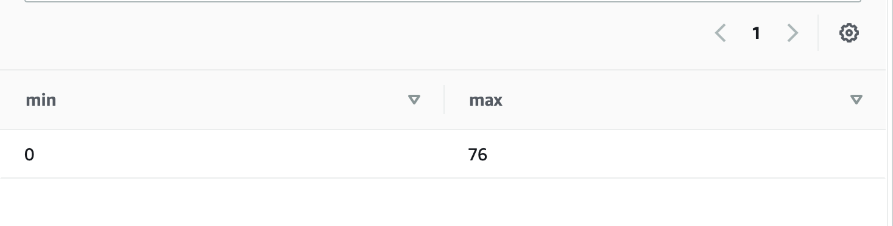
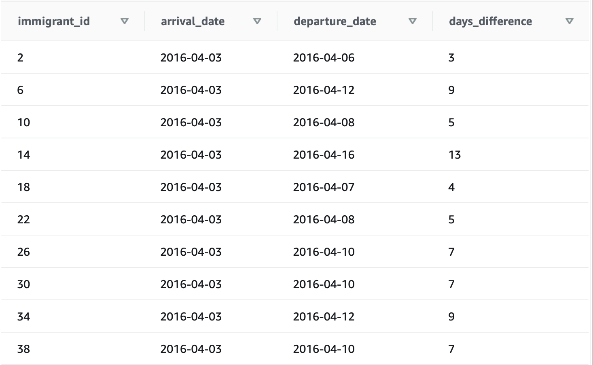
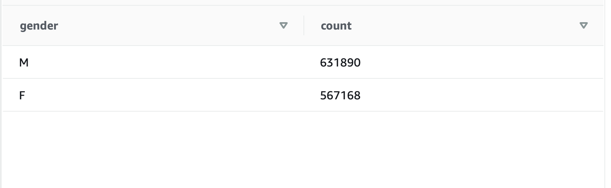
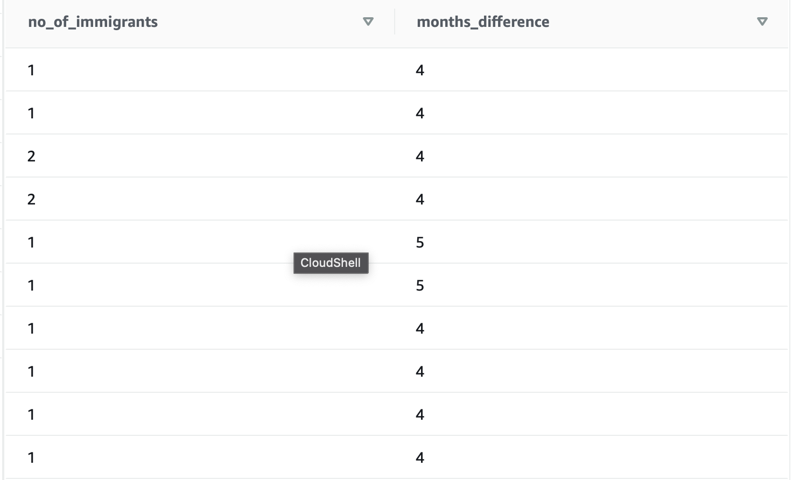

# udacity-capstone-project
Udacity's Data Engineering Capstone Project

## SCOPE
### THE PROBLEM (USE CASE)
A company decides to analyse the US immigration database to check student immigrants. The following are examples of questions they need answers to through their analysis:
    - What are the age ranges of immigrant students? <br>
    - How long do these immigrants stay in the US before departure? <br>
    - What is the ration of male to female immigrants for the available years? <br>
    - How many business men stay in the United State for more than 3 months> <br>
The company would also like to have answers to questioins like: <br>
    - What are the countries of residents of these immigrants, and the major race of people in the states they would be  residing? <br>
    - What cities get the most student immigrants? Population and most popular race in those cities? <br>

### SOLUTION
The goal of this project is to ensure the right data is gathered for a successful analysis by the team. Data Engineering tools like pandas, Amazon Redshift, Spark, and Airflow will be used for exploration, storage and manupilation of data. Each step will be discussed below.


## ENGINEERING STEPS
### DATA IDENTIFICATION AND GATHERING
To compute these analysis, datasets will be downloaded from the immigration and US Citites demography websites since the analysis team will be answering questions based on these two sets. <br>
    - Immigration dataset: https://travel.trade.gov/research/reports/i94/historical/2016.html <br>
    - US cities dataset: https://public.opendatasoft.com/explore/dataset/us-cities-demographics/export/ <br>

### DATA EXPLORATION
The `explore_data.py` prints a few rows on data for each dataset we will be making use of. It also displays the datatypes of each of the columns of each dataset.
This exploration is done with the Pandas library. Pandas, because of it's ease of use, and ability to load datasets of different formats (csv, parquet, json) into dataframes, and check for anomalies, nulls and outliers, column types.

### DATA CLEANING & MODELING
There are three (3) major steps taken in the data cleaning process:
    - Renaming Columns: to have more intuituve easy identifyable/explainable column names
    - Changing Columns datatypes: For example, Dates should have a DATE datatype, year and month should be Integers, rather than Floats as presented.
    - Handling null values: Here, rather than drip nulls, they are identified, and renamed with "not provided" in order not to lose some vital rows.
This cleaning process was achieved using Spark due to its fast, distributed data processing abilities - especially for large datasets. <br>
File Locations <br>
    Citites: `airflow/plugins/data_cleaning/cities.py` <br>
    Immigrations: `airflow/plugins/data_cleaning/immigrations.py`

#### Data Schema
The Galaxy Schema is used in this project - with two fact tables and 6 dimentional tables.
This schema is most suitable for this project due to the fact that two different sets of data are used to achieve this result. Also, it helps minimalize redundancy, and improve data accuracy.
Each dimension table is connected to its fact table, except the US_STATES table - connected to the US_Cities dimension table. Although, this requires a little more space taken for a table in the database, and one more join, it still allows for accurate data extractions.
Below are each tables schema in the database.

STAGING_IMMIGRATIONS (staging table) as loaded from S3 <br>
    |-- immigrant_id: (bigint) A unique, spark-generated id representing each immigrant  <br>
    |-- year: (integer) year the data was captured     <br>
    |-- month: (integer) month the data was captured  <br>
    |-- resident_country_code: (integer) The resident country code of the immigrant. <br>
    |-- arrival_date: (date) Date of immigrants arrival <br>
    |-- address: (varchar) Current US address of the immigrant (state code) <br>
    |-- departure_date: (date) Date of immigrants departure (if available)  <br>
    |-- age: (integer) age of immigrant (as at when this data was captured) <br>
    |-- visa_code: (integer) specifies the type of visa used. Equivalent to Business, Pleasure or Student. <br>
    |-- birth_year: (integer) Immigrants year of birth <br>
    |-- gender: (varchar) Immigrants gender <br>
    |-- airline: (varchar) The airline used by immigrant   <br>
    |-- mode: (varchar) mode of transport (code) equivalent to LAND, SEA, AIR. If available. <br>
    |-- resident_country: (varchar) The resident country of the immigrant <br>
    |-- visa_type: (varchar) specifies the type of visa used  <br>
    |-- state_address: (varchar) current US state address (unabbreviated).   <br>
    |-- transport_mode: (varchar) mode of transport (code derived). <br>

STAGING_CITIES (staging table) as loaded from S3 <br>
    |-- city_id: (bigint) unique, spark generated city identifier <br>
    |-- city: (varchar) US city name <br>
    |-- state: (varchar) US state name <br>
    |-- median_age: (real) median age of residents in this city <br>
    |-- male_population: (integer) male population of residents in the corresponding city <br>
    |-- female_population: (integer) female population of residents in the corresponding city <br>
    |-- total_population: (integer) total population of residents in the corresponding city <br>
    |-- num_of_veterans: (integer) total number of veterans in each corresponding city <br>
    |-- no_of_immigrants: (integer) total number of immigrants in each corresponding city <br>
    |-- avg_household_size: (real) average household size of city residents <br>
    |-- state_code: (varchar) US state code <br>
    |-- race: (varchar) most dominant rance in each city <br>

US_GEOGRAPHY (fact table) <br>
    |-- city_id: (bigint) unique, spark generated city identifier <br>
    |-- male_population: (integer) male population of residents in the corresponding city <br>
    |-- female_population: (integer) female population of residents in the corresponding city <br>
    |-- total_population: (integer) total population of residents in the corresponding city <br>
    |-- num_of_veterans: (integer) total number of veterans in each corresponding city <br>
    |-- no_of_immigrants: (integer) total number of immigrants in each corresponding city <br>
    |-- avg_household_size: (real) average household size of city residents <br>

IMMIGRANTS_FACTS (fact table) <br>
    |-- immigrant_id: (bigint) A unique, spark-generated id representing each immigrant  <br>
    |-- year: (integer) year the data was captured     <br>
    |-- month: (integer) month the data was captured  <br>
    |-- visa_code: (integer) specifies the type of visa used. Equivalent to Business, Pleasure or Student. <br>
    |-- mode: (varchar) mode of transport (code) equivalent to LAND, SEA, AIR. If available. <br>

US_CITIES (dim table) <br>
    |-- city_id: (bigint) unique, spark generated city identifier <br>
    |-- city: (varchar) US city name <br>
    |-- state_code: (varchar) US state code <br>

US_STATES (dim table) <br>
    |-- state: (varchar) US state name <br>
    |-- state_code: (varchar) US state code <br>

VISA_TYPES (dim table) <br>
    |-- visa_code: (integer) specifies the type of visa used. Equivalent to Business, Pleasure or Student. <br>
    |-- visa_type: (varchar) specifies the type of visa used  <br>

TRANSPORT_MODES (dim table) <br>
    |-- mode: (varchar) mode of transport (code) equivalent to LAND, SEA, AIR. If available. <br>
    |-- transport_mode: (varchar) mode of transport (code derived). <br>

TRAVEL_INFO (dim table) <br>
    |-- immigrant_id: (bigint) A unique, spark-generated id representing each immigrant  <br>
    |-- arrival_date: (date) Date of immigrants arrival <br>
    |-- departure_date: (date) Date of immigrants departure (if available)  <br>
    |-- airline: (varchar) The airline used by immigrant   <br>

IMMIGRANTS (dim table) <br>
    |-- immigrant_id: (bigint) A unique, spark-generated id representing each immigrant  <br>
    |-- age: (integer) age of immigrant (as at when this data was captured) <br>
    |-- birth_year: (integer) Immigrants year of birth <br>
    |-- gender: (varchar) Immigrants gender <br>
    |-- resident_country: (varchar) The resident country of the immigrant <br>
    |-- address: (varchar) Current US address of the immigrant (state code) <br>


#### SAMPLE QUERIES & RESPONSES
As a response to the sample questions mentioned in the scope, below are the queries to answer these questions.
- What are the age ranges of immigrant students?
    ```
    SELECT MIN(im.age), MAX(im.age)
    FROM immigrants as im
    JOIN immigrants_facts imf
        ON im.immigrant_id = imf.immigrant_id
    WHERE visa_code = 3;
    ```
    

- How long do these immigrants stay in the US before departure? <br>
    ```
    SELECT immigrant_id, arrival_date, departure_date, DATEDIFF(days, arrival_date, departure_date) AS days_difference
    FROM travel_info;
    ```
    

- What is the ration of male to female immigrants for the available years?
    ```
    SELECT gender, COUNT(gender)
    FROM immigrants
    WHERE gender = 'M' or gender = 'F'
    GROUP BY gender;
    ```
    

- Q: How many business men stay in the California for more than 3 months>
    ```
    SELECT COUNT(immigrants.immigrant_id) AS no_of_immigrants, DATEDIFF(months, arrival_date, departure_date) AS months_difference
    FROM immigrants
    JOIN immigrants_facts
        ON immigrants.immigrant_id = immigrants_facts.immigrant_id
    JOIN travel_info
    	ON immigrants.immigrant_id = travel_info.immigrant_id
    GROUP BY visa_code, arrival_date, departure_date, gender, address
    HAVING visa_code = '1' AND gender = 'M' AND address = 'CA' AND DATEDIFF(months, arrival_date, departure_date) > 3
    ```
    

### DATA LOADING PROCESSES
Both datasets are compiled and staged first, to an S3 bucket in parquet file format. This is done to have a Data Lake representation of both datasets/tables, and easy access to redshift.
Two major tools are used in this case: Spark - for loading the data, and Amazon S3.
Having these datasets stored in an S3 bucket allows an opportunity to use the Data Lake method (together with an analysis tool like Spark) if the cost of analysis on Redshift gets too high for the team.

A Data Warehouse option is also provided for proper data structiuring and reduction of Data Lakes chaotic feature among other reasons. Amazons Redshift tool is used as a warehouse to store these datasets in separate facts and dimensional tables. The S3 to Redshift process is carried out using Apache's Airflow - a DAG-based Data Engineering workflow management system. 
Airflow is used in this case to ensure each of the above processes are carried out in the right order, and the right scheduled time, making the ETL process as seamless as possible.

### DATA QUALITY CHECKS
- Null Value Checks
- Data Count Checks
- Data-types Checks

## Other Possible Scenarios
Q: If the data was increased 100 times: <br>
A: Spark would still be the best possible tools to be used for the Data Exploration and Manipulation processes, as well as loading these datasets to S3. Apache Spark's data processing is performed in memory, which means computations could be over 10 times faster than the MapReduce processing used in Hadoop. Also, Spark helps to automatically partition data based on the data size, and the number of cores in each node. If this data is 100times increased, partitioning should be adopted. Spark evenly distributes data based on the number of available cores per node.
Data partitioning can also be done on disk (or storage) using Sparks partitionBy() method. For example, storing the data in S3 by partitioning by year and month, gender or arrival date would go allow for effective data search and aggregations.
Because Apache Spark is an in-memory data engine, it does not provide a storage system. Storage of data can be done using Amazon S3. Having Spark installed on Amazons EMR will not only help manage processing resources (nodes and memory), but will save the organization compute costs, and use EMRFS as file storage

Q: If the pipeline was to be run on a daily basis by 7am
A: Airflow would serve best in this case. When defining the DAG, several parameters are provided by airflow for the Engineer to set-up to make scheduling seemless. To achieve this daily 7am schedule, below is an example of what the DAG arguments would look like: <br>
```
    dag = DAG(
        dag_id="generated_dag_id",
        start_date=(2021,07,15,07,00,00)
        schedule_interval="@daily"
    )
```
The dag parameters could also helper parameters like `retries`, `retry_delay`, `email_on_retry` to help notify the admin on possible failures and automatically set how many times a DAG should be retired. This reduces the workload of the Data Engineer - having to keep to exact time daily running the same pipeline repetitively. Engineers only have to set up these configurations and monitor these tasks on Airflow's Web UI. 
Apache Airflow can be run on Amazon's Managed workflow environment created on Amazons Linux AMI instances which helps to monitor queued and running tasks, and determine whether to scale Airflows workers on your environment.

Q: If the database needs to be accessed by 100+ people
A: Then Amazon's Redshift would do the storage work. Redshift is a data warehouse cloud-based system, storing data on a peta-byte scale. Replication would be advisable especially in cases where the database users are in several geographical locations. Redshift automatically creates snapshots that tracks changes to the cluster. Redshift also offers different data replication strategies for its clusters. For example, Amazon Kinesis creates replicas of redshift instances for differnet geographical zones, and ensures these instances are in sync with each other.
Although, charges are accumulated per time (each hour the redshift cluster is powered on accures charges), Amazon Redshift helps to lower the cost and operational overhead, allowing you to scale only as you need (as your data grows), and allows you to analyse large amounts of data in its natove format.


## RUNNING THE PROJECT
- Ensure to have all tools and libraries in the requirements.txt file installed, and your virtual environment activated
- To explore the datasets, run the `explore_data.py` file in the root of the project. `python explore_data.py`
- Ensure airflow is installed properly, and the `$AIRFLOW_HOME` and `$PYTHONPATH` variables are set to the root airflow directory
- Have a `config.cfg `file the root of the airflow folder. Check the `config.md` file to see what items need to be available in your `config.cfg` file
- Ensure you have ready an S3 bucket, and a Redshift Cluster (accesible) before running tasks on airflow
- To view the datasets after they have been cleaned and loaded to S3, run `python index.py` in your terminal.
- Your airflow should have the following connections: <br>
    A: aws_conn_id (should include access key and secret id) <br>
    B: redshift_conn_id (should include endpoint, DB schema, username and password, DB port)
- After Airflow has been installed, and database initialized, run `airflow webserver` and `airflow scheduler` on separate terminal windows to start tasks
- Go to localhost:8080 to see Airflow's UI, then trigger the 'immigration' DAG.