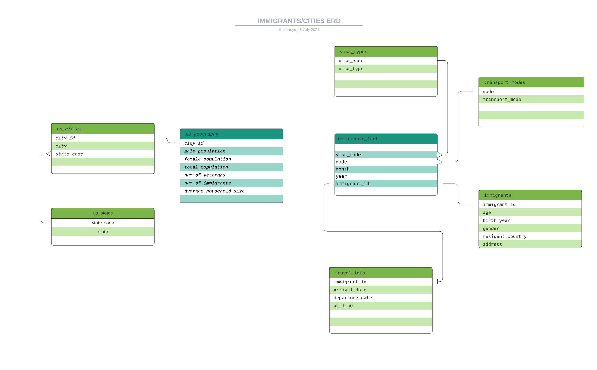

# udacity-capstone-project
Udacity's Data Engineering Capstone Project

## SCOPE
### THE PROBLEM (USE CASE)
A company decides to analyse the US immigration database to check student immigrants. The following are examples of questions they need answers to through their analysis:
    - What are the age ranges of immigrant students?  
    - How long do these immigrants stay in the US brfore departure?  
    - What is the ration of male to female immigrants for the available years?  
    - How many business men stay in the United State for more than 3 months>  
The company would also like to have answers to questioins like:  
    - What are the countries of residents of these immigrants, and the major race of people in the states they would be  residing?  
    - What cities get the most student immigrants? Population and most popular race in those cities?  

### SOLUTION
The goal of this project is to ensure the right data is gathered for a successful analysis by the team. Data Engineering tools like pandas, Amazon Redshift, Spark, and Airflow will be used for exploration, storage and manupilation of data. Each step will be discussed below.

## ENGINEERING STEPS
### DATA IDENTIFICATION AND GATHERING
To compute these analysis, datasets will be downloaded from the immigration and US Citites demography websites since the analysis team will be answering questions based on these two sets.  
    - Immigration dataset: https://travel.trade.gov/research/reports/i94/historical/2016.html  
    - US cities dataset: https://public.opendatasoft.com/explore/dataset/us-cities-demographics/export/  

### DATA EXPLORATION
The `explore_data.py` prints a few rows on data for each dataset we will be making use of. It also displays the datatypes of each of the columns of each dataset.
This exploration is done with the Pandas library. Pandas, because of it's ease of use, and ability to load datasets of different formats (csv, parquet, json) into dataframes, and check for anomalies, nulls and outliers, column types.

### DATA CLEANING & MODELING
There are three (3) major steps taken in the data cleaning process:
    - Renaming Columns: to have more intuituve easy identifyable/explainable column names
    - Changing Columns datatypes: For example, Dates should have a DATE datatype, year and month should be Integers, rather than Floats as presented.
    - Handling null values: Here, rather than drip nulls, they are identified, and renamed with "not provided" in order not to lose some vital rows.
This cleaning process was achieved using Spark due to its fast, distributed data processing abilities - especially for large datasets.  
File Locations  
    Citites: `airflow/plugins/data_cleaning/cities.py`  
    Immigrations: `airflow/plugins/data_cleaning/immigrations.py`

### DATA LOADING PROCESSES
Both datasets are compiled and staged first, to an S3 bucket in parquet file format. This is done to have a Data Lake representation of both datasets/tables, and easy access to redshift.
Two major tools are used in this case: Spark - for loading the data, and Amazon S3.
Having these datasets stored in an S3 bucket allows an opportunity to use the Data Lake method (together with an analysis tool like Spark) if the cost of analysis on Redshift gets too high for the team.

A Data Warehouse option is also provided for proper data structiuring and reduction of Data Lakes chaotic feature among other reasons. Amazons Redshift tool is used as a warehouse to store these datasets in separate facts and dimensional tables. The S3 to Redshift process is carried out using Apache's Airflow - a DAG-based Data Engineering workflow management system. 
Airflow is used in this case to ensure each of the above processes are carried out in the right order, and the right scheduled time, making the ETL process as seamless as possible.

### DATA QUALITY CHECKS
- Null Value Checks
- Data Count Checks
- Data-types Checks

## Other Possible Scenarios
Q: If the data was increased 100 times:  
A: Spark would still be the best possible tools to be used for the Data Exploration and Manipulation processes, as well as loading these datasets to S3.

Q: If the pipeline was to be run on a daily basis by 7am
A: Airflow would serve best in this case. A "@dail" schedule interval can be set on the DAG, and a start date - with a 7am start time

Q: If the database needs to be accessed by 100+ people
A: Then the best place to have this data after cleaning is the cloud. Having a Data Lake (S3 + Spark, Spark + HDFS, or Athema) or a Warehouse (Redshift) would allow easy and fast access to the database

## RUNNING THE PROJECT
- Ensure to have all tools and libraries in the requirements.txt file installed, and your virtual environment activated
- To explore the datasets, run the `explore_data.py` file in the root of the project. `python explore_data.py`
- Ensure airflow is installed properly, and the `$AIRFLOW_HOME` and `$PYTHONPATH` variables are set to the root airflow directory
- Have a `config.cfg `file the root of the airflow folder. Check the `config.md` file to see what items need to be available in your `config.cfg` file
- Ensure you have ready an S3 bucket, and a Redshift Cluster (accesible) before running tasks on airflow
- To view the datasets after they have been cleaned and loaded to S3, run `python index.py` in your terminal.
- Your airflow should have the following connections:  
    A: aws_conn_id (should include access key and secret id)  
    B: redshift_conn_id (should include endpoint, DB schema, username and password, DB port)
- After Airflow has been installed, and database initialized, run `airflow webserver` and `airflow scheduler` on separate terminal windows to start tasks
- Go to localhost:8080 to see Airflow's UI, then trigger the 'immigration' DAG.